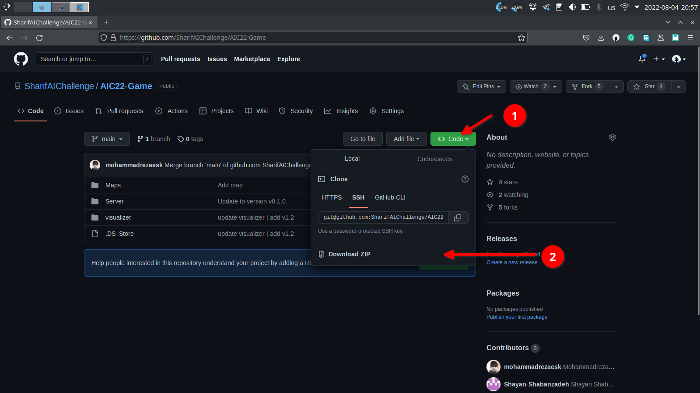
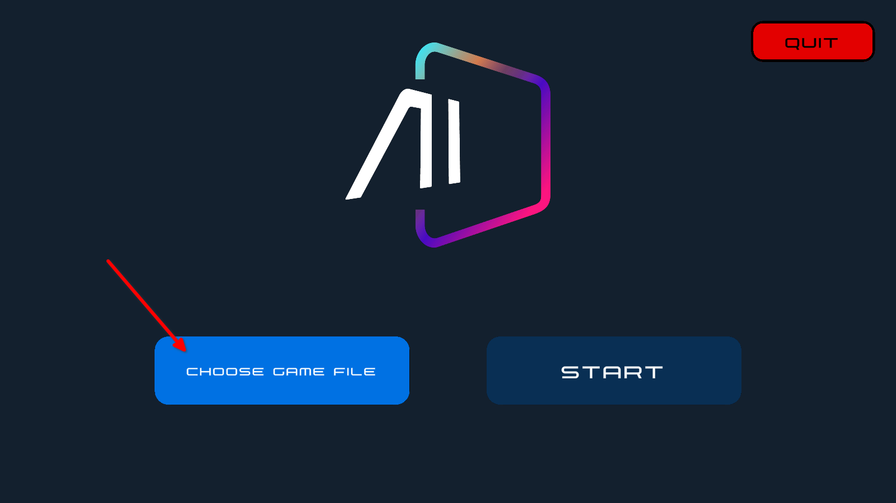

# شروع بازی در ۵ دقیقه
در این مستند، قصد داریم تا نحوه‌ی اجرای بازی 
AIC2022 
را در تنها ۵ دقیقه آموزش دهیم. برای اطلاع از جزئیات بیشتر به داک فنی مراجعه کنید. 


## 1. دانلود فولدر بازی
ابتدا باید فولدر بازی را از 
[مخزن فولدر بازی رویداد](https://github.com/SharifAIChallenge/AIC22-Game)
دانلود نمایید. سپس، آن را 
unzip 
کنید.
در این مخزن (ریپو)، تمامی موارد لازم برای اجرای بازی غیر از کلاینت‌ها قرار دارد. نقشه‌ها، آپدیت سرور و گرافیک بازی و ... از طریق این ریپو صورت می‌گیرد.



## 2. دانلود کلاینت مورد نظر
از بین ۳ زبان کلاینت موجود در مسابقه، یک زبان را انتخاب کرده و آن را از مخزن مربوطه دانلود نمایید. سپس آن را unzip کنید.
  * [کلاینت Cpp](https://github.com/SharifAIChallenge/AIC22-Client-Cpp)
  * [کلاینت Java](https://github.com/SharifAIChallenge/AIC22-Client-Java)
  * [کلاینت Python](https://github.com/SharifAIChallenge/AIC22-Client-Python)
دقت کنید که در این جا کلاینت را بیلد کنید (اگر از جاوا استفاده میکنید به صورت jar پکیج کنید) تا در مرحله بعد از آن استفاده کنید. 


## 3. اجرای بازی
در ویندوز، 
powershell 
و در سیستم عامل‌های دیگر، 
terminal 
را باز کنید. ابتدا با اجرای کد زیر مطمئن شوید که 
java 
نسخه بالا تر از ۱۶ 
را به صورت نصب دارید.
```bash
java --version
```
درصورتی که در جواب، ورژن جاوا نوشته شده باشد، به این معناست که شما جاوا را در دستگاه خود دارید. درغیر اینصورت و در صورت دادن ارور، بایستی با استفاده از [این لینک](https://java.com/en/download/help/download_options.html) جاوا را نصب کنید.  

```bash
java -jar <path to server jar file> --first-team=<path to first client executable file> --second-team=<path to first client executable file> <path to map.yml>
```
برای مثال اگر کلاینت شما در آدرس 
`/home/parsa/Desktop/AIC2022/AIC2022-Client-Java/AIC2022-Client-Java.jar`
باشد، پارامتر 
`--first-team`
به صورت زیر پاس داده می‌شود. 
```
--first-team=/home/parsa/Desktop/AIC2022/AIC2022-Client-Java/AIC2022-Client-Java.jar
```
به طور مشابه برای آدرس کلاینت دوم و همچنین آدرس سرور و فایل yml. 

* **توجه:** پس از اجرای کامند بالا مقداری طول می‌کشد تا بازی اجرا شود و یک سری لاگ در کنسول چاپ می‌شود. سپس فایلی در آدرس `logs/server.log` در محل اجرای برنامه ذخیره می‌شود.

## 4. دادن لاگ بازی به گرافیک
با کلیک کردن بر روی فایل
AIC22-Graphic.exe
 برنامه گرافیک بازی را باز کنید و با کلیک روی دکمه‌ی 
Chose a Game File
 ، آدرس فایل log بدست آمده در مرحله قبل را به آن بدهید.
پس از آن می‌توانید بازی را به صورت گرافیکی مشاهده کنید.
توجه کنید که روی سیستم‌عامل‌های unix based، با اجرای دستور `chmod +x /path/to/graphic/file` آن را قابل اجرا کنید.  
منظور از /path/to/graphic/file، آدرس فایل اجرایی گرافیک است. به طور مثال، روی سیستم‌عامل لینوکس، فایل Linux.x86_64
 فایل اجرایی گرافیک است، پس باید مقابل دستور chmod +x، آدرس این فایل را قرار دهید.




## 5. تامام تامام
شما توانستید بازی را با کلاینت پیش‌فرض اجرا کنید. حال می‌توانید با تکمیل کد در قسمت هایی که با کامنت 
`TODO` مشخص شده اند
 در کلاینت مورد نظر خود، کد دلخواه خود را برای هریک از نیرو‌ها بزنید و به همان شکل آن را اجرا کنید.
هم‌چنین بعد از باز شدن امکان ارسال کد بر رو سایت می‌توانید کل فولدر کلاینت را زیپ کرده و بر روی سایت بفرستید تا رتبه خود را در اسکوربورد تغییر دهید.
